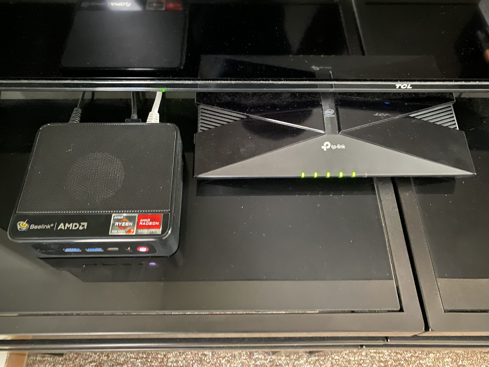

# Homelab

Our goal with this project is to establish a solid foundation for a Homelab, creating a base off of which we can expand to a multitude of other side projects, all powered by our Homelab - and other free, open-source projects.

To that end, we settled on buying a mini-PC, where we will install [Proxmox](https://www.proxmox.com/en/), an "open-source platform for enterprise virtualization". This is a fantastic option for us because instead of having to buy specialized hardware for each of our target functionalities we want to add to our Homelab (router/full control of our networking, HomeAssistant, network-wide adblocking and tracking blocking, etc.), we can simply spin up a VM inside our Proxmox server and dynamically adjust resources and components, without the financial overhead of having to buy additional hardware for each. Additionally, aside from being completely free and open-source, it is an enterprise-grade virtualization solution, which allows for the clustering of machines if we decide in the future that we want to host highly-available services.

The second key component of our Homelab is our networking infrastructure. We once again want a free and open-source solution, which gives us full control of our network - so we settled on [pfSense](https://www.pfsense.org/). It is one of the most trusted open-source network security solutions, packed full of features, many of which we will make use of. Aside from its routing and firewalling capabilities, it can be virtualized in our Proxmox server and has a suite of packages that can be installed to provide extra functionalities - such as `HAProxy` for reverse proxying our services with support to SSL/TLS, `OpenVPN` for connecting back home and having remote access to all of our devices, `ACME Certificates` for generating and automatically renewing our *Let's Encrypt* certificates, `IDS/IPS` capabilities for network monitoring and security, `DDNS` for keeping our DNS records up to date on our current assigned IP, and many more.

With both of these components set, we then have a wide variety of projects that we can work on:

* We can buy a domain and, with `DDNS`, have our DNS records point at our home IP address, thus being able to host anything we want. For added security, we can use a provider like Cloudflare, which filters and proxies any incoming traffic and only sends TLS/SSL encrypted requests to our home, adding a layer of protection to our home without revealing our IPs to the public.
* We can spin up 5 Linux VMs and install some container orchestration, such as [k3s](https://k3s.io/) - a stripped-down, certified Kubernetes distribution for resource-constrained applications - and learn about Kubernetes, CI/CD, and HA hosting.
* We can run [HomeAssistant](https://www.home-assistant.io/) on yet another VM, automating our home.
* Etc.

## Hardware

That leads us to our hardware selection:

* Beelink mini PC
* USB-A Ethernet Adapter
* 500GB SATA SSD
* Wifi Access Point
* Assorted cables

## Networking

*Note: While we'll try to be as thorough as we can, we **will** omit specific IP addresses, domain names, and any forms of IDs that we believe could compromise our home network safety or provide unnecessary insight into our network. If there are any inconsistencies between specific IP addresses we mention - say, for example, we say in one section that our Proxmox machine's IP is x, but later on a screenshot it's y, that does not necessarily mean we misconfigured something, but rather they are all examples. The important thing is that in your implementation everything that should match matches. That's why we keep a private table with all static IP addresses we've assigned and their respective devices/VMs/notes.*

### Considerations

As we've mentioned above, our networking design/infrastructure is one of the most important and complicated aspects of our project. While we want to be as flexible as possible, we also want to err on the side of safety and not expose ourselves to any dangers as we explore all of our side projects. Projects that involve hosting any services publicly inherently hold a risk, which we will always try to mitigate with good safety practices and a good amount of encryption.

### Design

With all this said, let's dive into our network design.

Our network will live in the `10.10.0.0/16` address space. We settled on this large block of IPs for a few reasons. Firstly, while we will not support VLANs as of right now - since we would need to buy managed switches and some extra hardware -, we want to logically organize our network in the format `10.10.<VLAN ID>.*` from the get-go, so that adding VLAN firewall rules later on will be a smooth process. This also makes it generally easier to assign static IPs coherently.

Our core and trusted devices - such as our Proxmox server, our PC, and our laptop - will go on the `10.10.0.0/24` network. We'll start numbering them from *10.10.0.50* onward - a somewhat arbitrary choice -, leaving some IP space before them in case we have another block of devices in the future we want to address there.

A special exception to this is our [pfSense](docs/2_pfsense.md) instance, which is virtualized in our Proxmox server and will have the address `10.10.0.1`, as it will also be the default gateway for all devices in our network.

Here's a table that summarizes all of our network design: 

| Network        	| Name                                                                            	| Comment                                                                                                	|
|----------------	|---------------------------------------------------------------------------------	|--------------------------------------------------------------------------------------------------------	|
| 10.10.0.0/16   	| Our whole netowrk                                                               	|                                                                                                        	|
| 10.10.0.0./24  	| Out trusted devices network                                                     	|                                                                                                        	|
| 10.10.1.0/24   	| Other trusted devices, but perhaps less trusted.                                	| RaspberryPi's, Jetson Nano's, and other "trusted" devices that are not our most trusted and sensitive. 	|
| 10.10.2.0/24   	| Our main trusted VMs, such as networking-related VMs, TrueNAS, HomeAssistant... 	| Want to be reachable from trusted devices.                                                             	|
| 10.10.3.0/24   	| IoT, untrusted devices.                                                         	| These should not be able to communicate with trusted devices and services, except for HomeAssistant.   	|
| 10.10.4.0/24   	| IPTV Cameras - not in use currently, but in the future.                         	| These have no reason to have internet access.                                                          	|
| 10.10.5.0/24   	| ...                                                                             	|                                                                                                        	|
| 10.10.100.0/24 	| Our DHCP server pool lives here.                                                	| Essentially a guest network, as all trusted devices will have static mappings.                         	|
|                	|                                                                                 	|                                                                                                        	|

## Other components

We have separated each of our other components into their respective Markdown files. We listed them here for reference, in the order that we set them up.

1. [Proxmox](docs/1_proxmox.md)
2. [pfSense](docs/2_pfsense.md)
3. [PiHole](docs/3_pihole.md)
4. [TrueNAS](docs/4_truenas.md)
5. [HomeAssistant](docs/5_homeassistant.md)
<!-- 6. [k3s]() -->