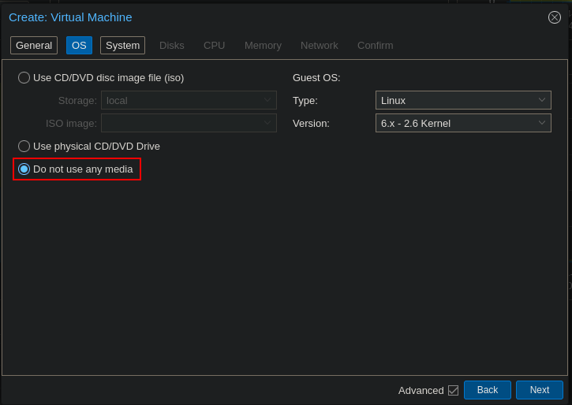
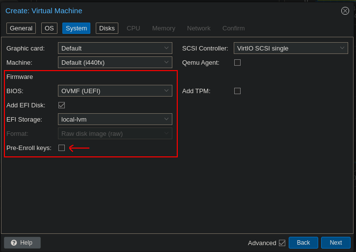

# 

## Installation

Installing [Proxmox](https://www.proxmox.com/en/proxmox-virtual-environment/get-started) is as simple as installing their latest ISO from their [Downloads page](https://www.proxmox.com/en/downloads), burning the image onto a USB Drive, booting into it and following the on-screen instructions. They also have great [documentation](https://pve.proxmox.com/pve-docs/chapter-sysadmin.html) of the whole installation and configuration processes.

## Configuration

The initial Proxmox configuration is relatively simple, but crucial to get right. That is because our Homelab has a unique quirk: as we mentioned before, we'll virtualize our router with pfSense inside of Proxmox. However, Proxmox - being a device in our network -, needs internet access through our router for many important reasons: NTP, updates, web configuration portal, etc., all of which do not work unless our pfSense VM is up and running - a sort of "network bootstrapping". 

To solve that, we assign static IP and network configurations for the Proxmox machine on the `vmbr0` bridge (our LAN bridge) instead of using DHCP, and we will reflect that with a static mapping on our pfSense settings. Thus, while Proxmox itself is booting, it will not have internet connectivity or a DCHP server to request an address lease, but once it spins up the pfSense VM - which we configure to turn on immediately on boot - it will get a connection and have all the access it needs.

This brings us to another point simple but important point: VM boot order. Proxmox has a really nifty feature, where we can choose not only whether to spin up a VM on boot, but the order in which to do so and the delay between each VM spinup. Thus, we configured the pfSense VM to immediately spin up on boot, and only after a 240-second delay to ensure it is fully up, we progressively turn on the other VMs that rely on networking being up to function. We will get to those in the later steps of the project. Here's the configuration for the pfSense VM:


### Network

Our Proxmox machine will have 2 wired Ethernet connections: one coming from our ISP's modem - which will be our WAN -, and another which will go to our switch/WAP - which is our LAN. Since our mini-PC only has one built-in Ethernet adapter, we bought a USB-to-Ethernet adapter. We arbitrarily assigned our onboard Ethernet adapter to be our LAN, and the adapter one to be our WAN - perhaps because we care more about LAN stability and performance, rather than WAN, as many of our more network-intensive services are inward-facing.

Then, we make two Linux bridges, one for each adapter - `vmbr0` for LAN and `vmbr1` for LAN. This is what will be passed to the VMs, which provides them with a network connection. Then, as we mentioned above, we solve our "network bootstrapping" problem by statically assigning our network configuration for our Proxmox machine on the `vmbr0` (the LAN bridge) like so:

* IP: 10.10.0.50/16
* DNS: 10.10.0.1 *(our pfSense VM's IP)*
* Gateway: 10.10.0.1 *(our pfSense VM's IP)*
  
Here's a screenshot of our Proxmox network configuration:


## Services and VMs


### Template VM

### pfSense

### PiHole

### TrueNAS

### HomeAssistant

To set up HomeAssistane, we first logged in to our Proxmox machine as *root*. Then, we downloaded the `.qcow2` HomeAssistant disk from the [HomeAssistant's guide](https://www.home-assistant.io/installation/alternative#install-home-assistant-operating-system) with

```bash
cd
wget https://github.com/home-assistant/operating-system/releases/download/12.2/haos_ova-12.2.qcow2.xz
```
Then, we created a new VM with no local disk:



From there, under the *System* tab, we change the BIOS to UEFI, select the EFI Storage, and **disable** *Pre-enrolled keys*, or otherwise the HomeAssistantOD does not boot:



Then, on the *Disks we delete the *scsi0* default disk since we downloaded as we'll be importing the one we downloaded previously from the HomeAssistant guide. After that, we give the VM 2 CPU cores and 2GB of RAM - as these are the minimum recommended specs, as can be seen [here](https://www.home-assistant.io/installation/alternative#create-the-virtual-machine) -, and finally we select `vmbr0` as our network (as we established that this is our LAN bridge).

Optionally, we can also set this VM to turn on on boot, so it will automatically spin up. This is recommended, as we might depend on it for many home functions.

Our VM setup is almost done, all we now have to do is attach our downloaded disk onto the VM. We first extract the *.xz* file we downloaded and import it onto the VM with

```bash
unxz haos_ova-12.2.qcow2.xz
qm importdisk <VM ID> haos_ova-12.2.qcow2.xz local-lvm
```

Now, all we have to do is turn on the VM and follow HomeAssistant's Installation, which we go over [here](5_homeassistant.md#instalaltion).

### k3s
