# 

## Dashboard

Here's a sneak peek of our final pfSense dashboard, after applying all the configurations we go over in this document:

## Installation

Installation is made very simple by following Netgate's guide to virtualize pfSense with Proxmox, which can be found [here](https://docs.netgate.com/pfsense/en/latest/recipes/virtualize-proxmox-ve.html). As will not cover the installation steps as we would not do justice to Netgate's resources.

## General Setup

Then, once pfSense is installed, we once again spin up the VM and do some initial configuration through its command line:

First, as discussed in the [Proxmox](1_proxmox.md) section, we set the `vmbr0/vtnet0` bridge to be the LAN interface and `vmbr1/vtnet1` to be the WAN interface in pfSense. Then, since we want our router to also have a static IP address for obvious reasons, we specify the static IP `10.10.0.1/16` on the LAN interface (`vmbr0/vtnet0`).

Lastly, we reset our *webConfigurator* password, so we don't have the default `admin:pfSense` username and password. This is only temporary, as later we will create another user with admin privileges, and disable the default admin user login.

From there, we just follow the initial [setup wizard](https://docs.netgate.com/pfsense/en/latest/config/setup-wizard.html) to set the basic configurations for pfSense:

We kept our hostname as `pfSense` but changed our domain to the one we bought from Cloudflare for the later stages of the project. For documentation purposes, let's refer to our domain name as *homelab.com*. This then makes our pfSense VM have the FQDN of *pfsense.homelab.com*.

Finally, we'll leave the *Primary DNS Server* empty for now, but once we set up our *PiHole* ad-and-traffic-blocking DNS service, we'll put its static IP address here and a public DNS as backup, which will direct all DNS queries from the entire network to PiHole, as long as we set pfSense's IP as the DNS on all of our DHCP configurations - thus achieving a network-wide ad blocking and advertisement tracking blocking. We recognize that the is an argument about whether blocking ads is a good practice or not, but setting up PiHole does not necessarily mean we will block all ads, as all this depends on what block lists we add to our PiHole instance. One can just as well only add lists of known malicious domains, but allow safe ads to be shown.

## Configurations

After going through the wizard, we have yet a few other modifications we'll need.

First, we need to free up port 443, or the default `HTTPS` port. It is currently being used for the *webConfigurator* portal for pfSense, but we will need it to be free for `HAProxy`, which we'll use to host multiple services through the domain we bought through Cloudflare. And since we're here, let's force the *webConfigurator* to work only through HTTPS (which is much safer, even if we're using our self-signed pfSense certificate) and disable the redirect rule. We'll need to remember we're now using `pfsense.homelab.com:10443` as our *webConfigurator* address from now on (we recommend taking notes of these addresses and ports and *highly* recommend using something like [Trotto go/links](https://www.trot.to/) for ease of use, as this will not be the only service that runs on a custom port which needs to be remembered).

### DHCP

The next step is to set up our DCHP server, which is simple. All we do is go to **Services > DHCP Server > LAN**, and enable it with the following settings:

### Static IP reservations

As mentioned many times, we will assign static IP addresses for all of our core devices and services that we will need to address in the future: our Proxmox server, pfSense, PiHole VM, TrueNAS VM, HomeAssistant VM, our PC (for remote access, so we can access all our resources from our laptop from anywhere), etc. All of these static mappings live here.

### DNS

While DNS is not strictly speaking a hard concept to understand, or a hard part of the project to implement, it is more often than not the source of many of the problems we faced in our Homelab project, and it is generally very hard to trace.

Here's a superb *haiku* we found about this, which helps us always remember to check DNS before we find ourselves too deep into trying to solve a seemingly unrelated and unsolvable problem:

#### DNS Resolver

[**DNS Resolver**](https://docs.netgate.com/pfsense/en/latest/services/dns/resolver.html) is one of the services available in pfSense, which "utilizes `unbound`, which is a validating, recursive, caching DNS resolver that supports DNSSEC, DNS over TLS, and a wide variety of options. It can act in either a DNS resolver or forwarder role".

We will use the **DNS Resolver** to make some DNS entries, so that we can have local addresses to our devices/VMs, and so we can resolve hosts by their hostname automatically, either from their DCHP lease, static mapping, or later by their hostname in OpenVPN. As an example, say we have a TV with hostname `rokutv`. Then, in HomeAssistant, for example, we can refer to the TV by its hostname rather than its IP address, without having to manually add a DNS entry for every device - this is done automatically for us.

Strictly speaking, this could be done in PiHole, as it also has a DNS Resolver. However, it is somewhat limited, and we prefer to keep a separation of duties, where PiHole will only handle DNS blocking, and pfSense will handle all the local hostname resolution - so we keep all network-related configurations in one place. Thus, if we think about the path a DNS request makes in our network, it will be:

**Device making request > pfSense's DNS Resolver > PiHole > Upstream DNS (Google's or Quad9)**

As we mentioned in the Wizard section, we also added a public DNS service as a secondary DNS server in the General Configuration in case our PiHole fails, so we don't take down the entire network because one VM is down.

#### PiHole

There are a few different ways of forwarding all of our DNS queries to PiHole. We chose the cleanest, which involves setting up the IP address of the PiHole machine in a single place. This way, if we ever change the IP address of the PiHole VM, we'll only have to update a single configuration in pfSense, and everything else should work.

To do so, we went to *System > General Setup > DNS Server Settings*, and added PiHole's IP address as the **first** DNS server. We also added two other public DNS servers: Quad9's DNS and Google's DNS. We also made sure to **NOT** check the *DNS Server Override: Allow DNS server list to be overridden by DHCP/PPP on WAN or remote OpenVPN server* box (so that our DNS configurations aren't overriden by whatever our ISP's DHCP configuration is), and made sure we selected *Use local DNS (127.0.0.1), fall back to remote DNS Servers (Default)* under *DNS Resolution Behavior*, like so:

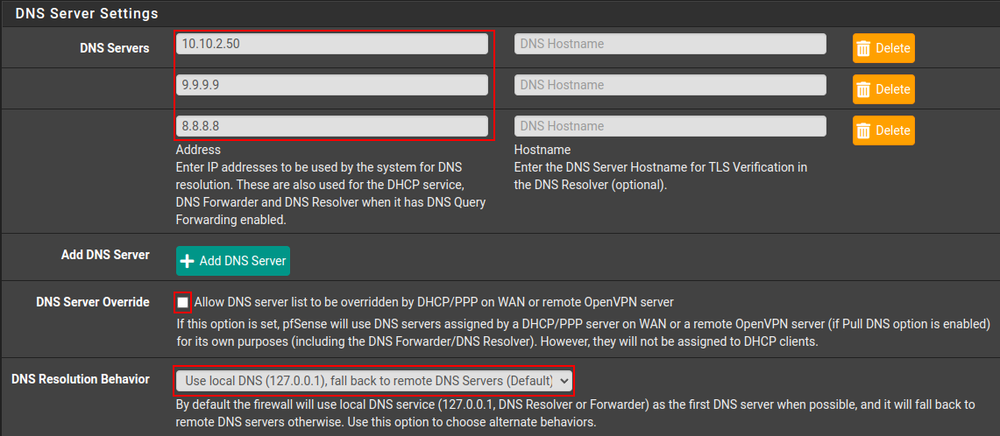

This way, as we discussed above when talking about our [DNS Resolver](#dns-resolver), pfSense (*10.10.0.1*) will be our DNS server for the network. So when a device makes a DNS request, it will do so to pfSense, which will forward it to [DNS Resolver](#dns-resolver). This service will then check for any DNS overrides, and if not overridden, will then forward the request to PiHole (the first address on our DNS Servers). If PiHole fails to respond/is down, it then falls back to the other two public DNS addresses - which are very reliable, so we won't break our network because of DNS. If PiHole is available, as it should always be, then it will filter the requests based on the blocklists we set there and only then, if not being blocked by our lists, it will forward that request to a public DNS server and resolve the query, sending the response back the opposite path. A *very* in-depth explanation of the whole process can be found [here](https://docs.netgate.com/pfsense/en/latest/services/dhcp/ipv4.html#servers).

For all this to work, when setting up [DHCP](#dhcp), it is important to **NOT** add any DNS overrides. So the fields under *Services > DNS Resolver > Servers* should look like this:

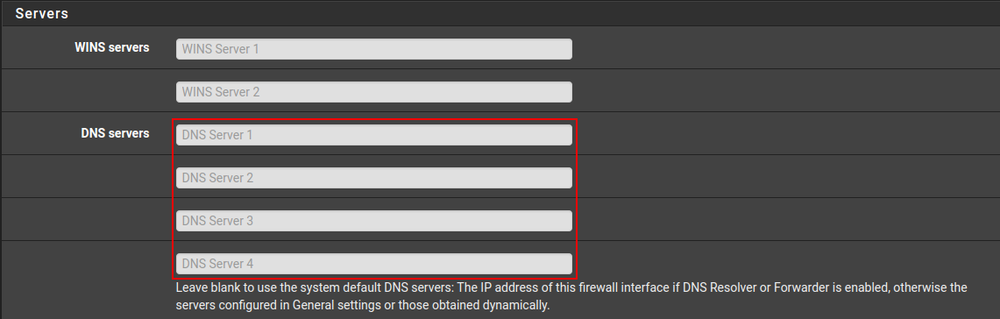

This makes the DHCP Server's DNS server be pfSense itself. This behavior is documented on the bottom of the image and in Netgate's Docs, [here](https://docs.netgate.com/pfsense/en/latest/services/dhcp/ipv4.html#servers).

#### DDNS

Since we're using Cloudflare as our DNS provider, to keep our "*homelab.com*" record always pointing to our home IP address, all we have to do is navigate to **Services > Dynamic DNS** and click **Add**. From there, we just have to fill out the fields with our Cloudflare information, as pfSense instructs:

Since we are hosting all of our services from home, it is easier to make all of our subdomains automatically point to our home IP address with a single DDNS daemon. We can do this by putting a `@` on the *Hostname* field, followed by our *homelab.com* address on our domain field. If we were hosting other services in other places - like AWS, GCP, or anything else outside of our home - we could create one DDNS entry specifically for each subdomain hosted at home, so instead of `@` we could put something like `homeassistant`, if we wanted to access our HomeAssistant service from `homeassistant.homelab.com`.

Another important thing is to enable the **Cloudflare Proxy**, which is supported out-of-the-box by pfSense. As the description states, this makes all of our services' traffic be routed to Cloudflare's servers before going to the requesting client. This has the benefits of hiding our home IP from the public, making use of Cloudflare's DDoS protection, and is fully encrypted between home and Cloudflare, where it will apply our TLS/SSL certificates there before forwarding the connection to the clients. And since we also bought our domains from Cloudflare, they automatically issue trusted TLS/SSL certificates for our "*homelab.com*", which makes our connection encrypted from end to end and very secure.

With that done, we should have a successfully set up DDNS service which appears like so:

One of the benefits of building a Homelab like we're doing is that we can host our own VPN, which allows us to connect back home and have full access to our devices without exposing or forwarding any ports on our router. For example, as a college student, this has been extremely helpful for working on homework and projects that require more computational power - we could simply connect to our VPN and safely SSH into our PCs. This, combined with our encrypted and locked-down VPN service, makes for a much safer way of connecting back home and greatly reduces the risk of unauthorized parties having access to our devices and data. Another benefit is that we can also forward *all* traffic to our network when connected from somewhere else, which will also forward all DNS traffic to our home router, which will keep filtering and blocking undesired requests.

### OpenVPN

We used pfSense's guide on how to set up OpenVPN, which can be found [here](https://docs.netgate.com/pfsense/en/latest/recipes/openvpn-ra.html) and [here](https://docs.netgate.com/pfsense/en/latest/vpn/openvpn/index.html).

Then, there is a package that we can install under *System > Package Manager* called *openvpn-client-export*. It makes the process of exporting client configurations - with their respective keys - effortless. All you have to do is create a user for each person you want to have access to your VPN under *System > User Manager*, apply the appropriate permission/settings, and make sure to add a certificate for that user when creating it in the *User Certificates* section:

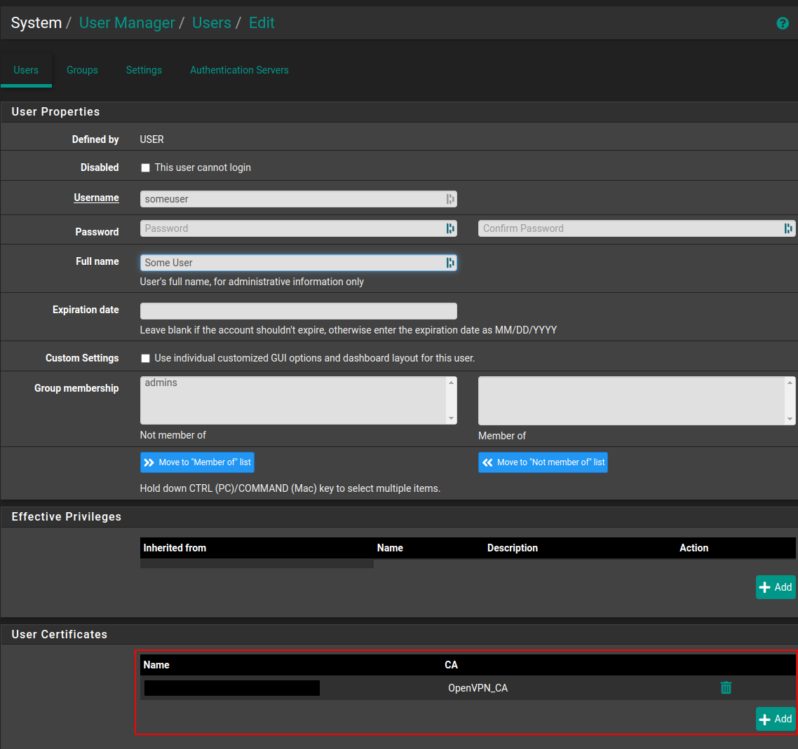

and then create a certificate with the OpenVPN Certificate Authority (CA) like so:

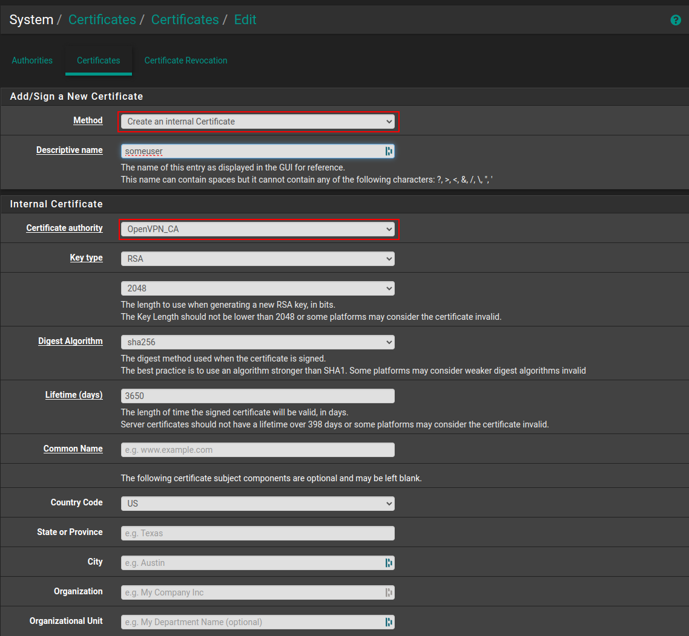

Then, to export a new client's configurations, which can be imported into an OpenVPN client, we just have to go to *VPN > OpenVPN > Client Export > OpenVPN Clients* and pick the appropriate file kind.

### Hosting

This part of the setup assumes that your ISP provides you with a public IP, even if not static (which is taken care of by [DDNS](#ddns)).

#### Cloudflare

 > Cloudflare, Inc. is an American company that provides content delivery network services, cloud cybersecurity, DDoS mitigation, and ICANN-accredited domain registration services. ([Wikipedia](https://en.wikipedia.org/wiki/Cloudflare))

For this part of the project, we bought a domain so that we can host our services publicly if we choose to do so. We chose to buy our domains from Cloudflare for a few reasons: Cloudflare is one of the largest DNS registrars and included in the domain price, we get a very wide variety of very useful services - such as DDoS protection, free TLS/SSL certificates for all our subdomains, and a lot of great security features that we'll use to make our Homelab safer. You can get started registering a new domain [on their page](https://www.cloudflare.com/products/registrar/).

While there are a lot of cool things to explore on our Cloudflare Dashboard, the only things we need to do to make our setup work are go to our domain, and under *DNS > Records* on Cloudflare, add a type *A* record with *\** as our *Name*, paste your IP address (which can be found on pfSense under *Services > Dynamic DNS*), and make sure *Proxied* is on. The result should look like this:

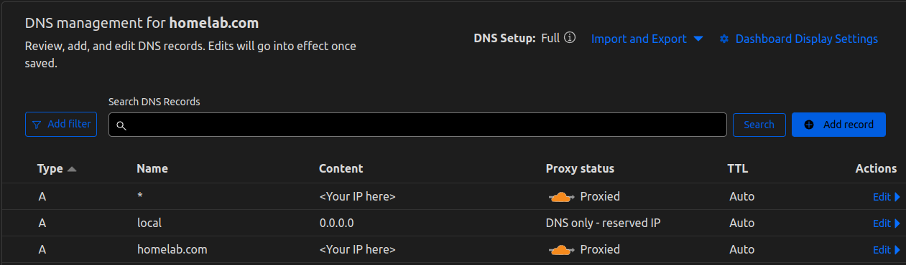

The other setting is explained in the [section below](#acme-certificates). That setting can be found and modified under *SSL/TLS > Overview* on the Cloudflare Dashboard.

#### ACME Certificates

Even though Cloudflare already issues and applies trusted TLS/SSL certificates for traffic on our domains - since they can inherently guarantee clients that the domain is ours, as we bought it from them and our [DDNS](#ddns) service is authenticated with our Cloudflare account keys, and they will proxy all our traffic - we will also get our own set of certificates for free with [*Let's Encrypt*](https://letsencrypt.org/how-it-works/) as an added layer of security. 

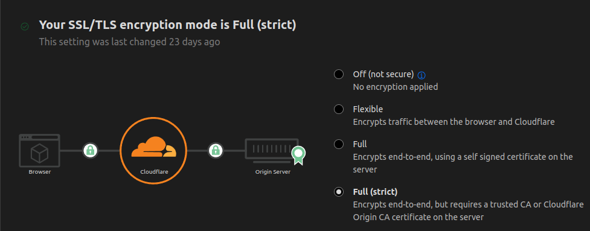
*Note: This setting can be found and modified under *SSL/TLS > Overview* on the Cloudflare Dashboard.*

We chose to do this extra step because, as the diagram above explains, the Cloudflare-issued certificates are only applied to our traffic between Cloudflare's proxies and the clients (left-hand side on the diagram, which is the *Flexible* mode). This is not very safe because traffic between our pfSense's HAProxy and Cloudflare would not be encrypted, so anyone who can intercept and capture this traffic would be able to see our plain-text data flowing between us and our proxies.

*Full* mode mitigates that by encrypting that traffic with another certificate. This certificate, however, does not need to be a trusted certificate; we could simply use our self-signed certificate generated by pfSense (the same one that is the default certificate for the *webConfigurator*, generated by default). This has the benefit of encrypting the traffic between us and Cloudflare, preventing the man-in-the-middle attack we mentioned previously.

However, there is one last problem: with just our self-signed certificate, Cloudflare cannot guarantee that the machine that answered their request is actually us. As an extreme example of this, imagine that gets a hold of our IP address and can receive traffic directed to it. Then, they could simply respond to requests originally directed to us and encrypt the response with anything they want, and Cloudflare would have no way of knowing it was not us who replied to that request. By having our own trusted TLS/SSL certificates, with which we sign all traffic, Cloudflare can simply check the certificate's validity - which is guaranteed by *Let's Encrypt*, a trusted Certificate Authority -, and authenticate that our response was legitimate. This configures the *Full (strict)* mode, which we'll use.

Understanding this is the hardest part, but setting it up is very straightforward. First, we go to *Services > ACME Certificates > Account keys* (after having installed the *acme* package under *System > Package Manager*), and click *+ Add*.

We then give it some name like `LetsEncrypt_Test` and optionally a description, and pick the option *Let's Encrypt Staging ACME v2...* as outlined in the image below:

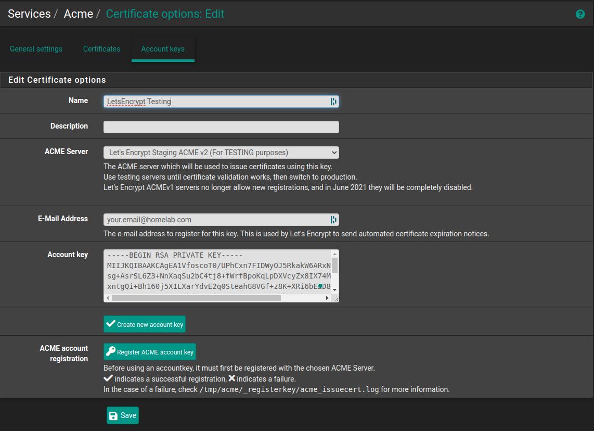

Then, click on *Create new account key*. This will populate the *Account key* field with a private key. Then we'll click on *Register ACME account key* and wait for that to complete. Once that's done, we can click on *Save*.

Now, we'll do the same procedure again, but name it `LetsEncrypt_Prod` and select the option *Let's Encrypt Production ACME v2...*. We can now copy and paste the key generated earlier, and click *Save*. We do this because the Prod server has a rate limit, and we'll get temporarily banned if we exceed it, so we'll ensure everything works on Testing and only then switch to Prod.

Now, go to *Services > ACME Certificates > Certificates*, and click on *+ Add*. Fill out the fields as below, selecting the Staging account we created above and *Webroot local folder* as the authentication method. Any fields not shown can be left empty:

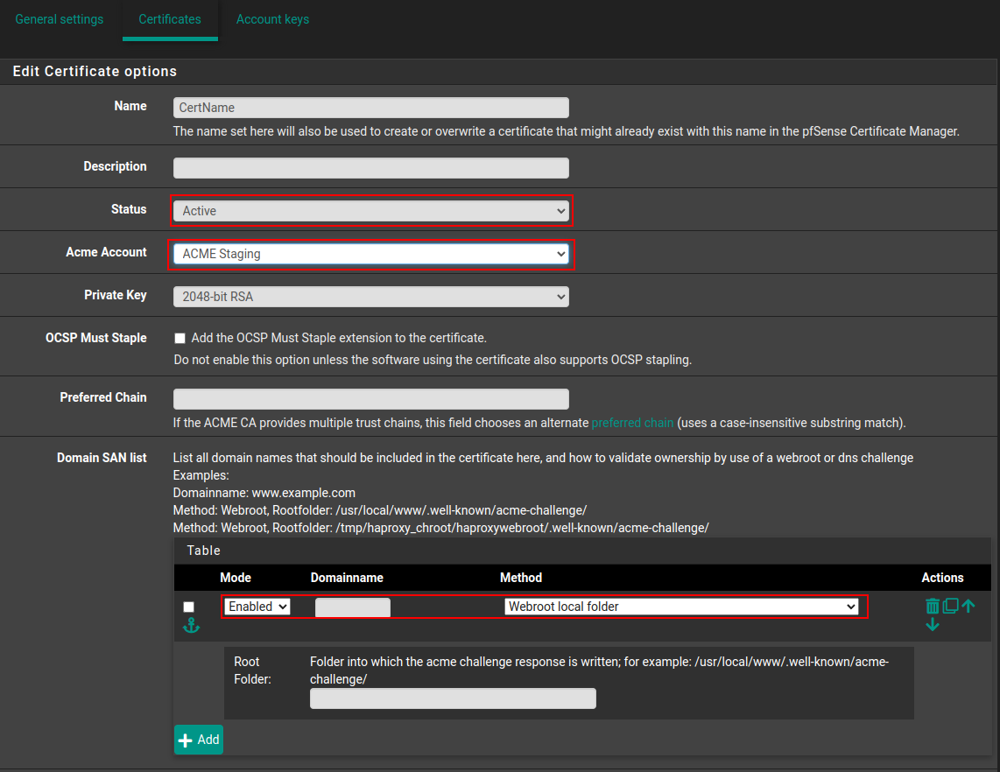

Click *Save* and then *Issue/Renew* on the certificate. If everything goes well, it shold look something like this:

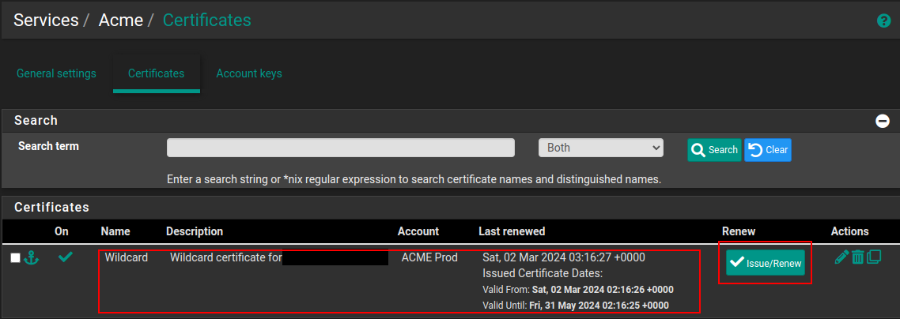

Now that this was successful, we'll go to *Services > ACME Certificates > General Settings* and make sure both *Cron Entry* and *Write Certificates* are checked. Then, go back to *Services > ACME Certificates > Certificates*, edit the certificate we just made, and change the account to the Production one we created earlier (and optionally rename it to reflect it's a Prod cert now). Re-issue the certificate, and we should be all set! We can now use this certificate for all our outbound traffic.

#### HAProxy

Now, hosting our services is really easy! All we have to do is, for each service we want to expose, go to *Services > HAProxy > Backends*, *Add* a new one like so:

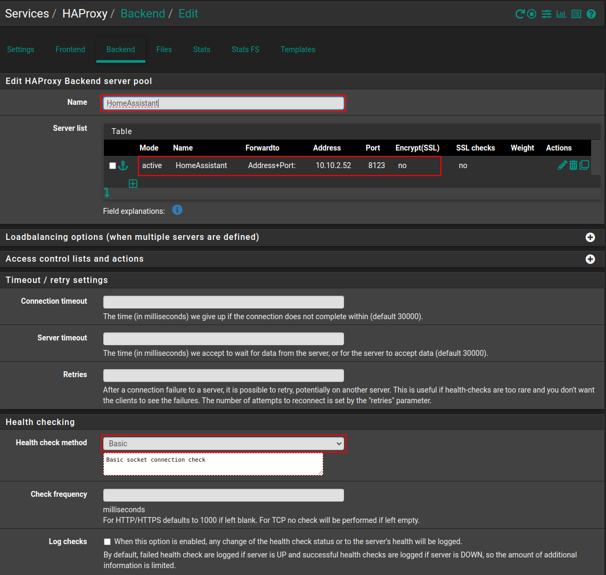

Add the service's local IP address and its port in the server list, give it some descriptive name, set it to active, and make sure to check/uncheck *Encrypt(SSL)* depending on whether that service serves over HTTP or HTTPS. HomeAssistant, for example, does not, so we leave it unchecked. We can also add a *Basic* Health check, which just periodically pings the IP to see if is up, which is displayed on the dashboard.

The resulting Backends will look like this:

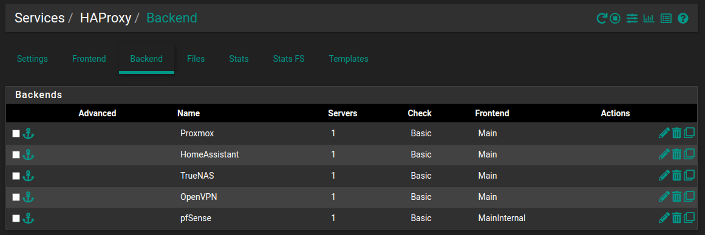

Then, just go to *Services > HAProxy > Frontends* and create one new Frontend. Once again, give it some name, set it to active, and add the following configs:

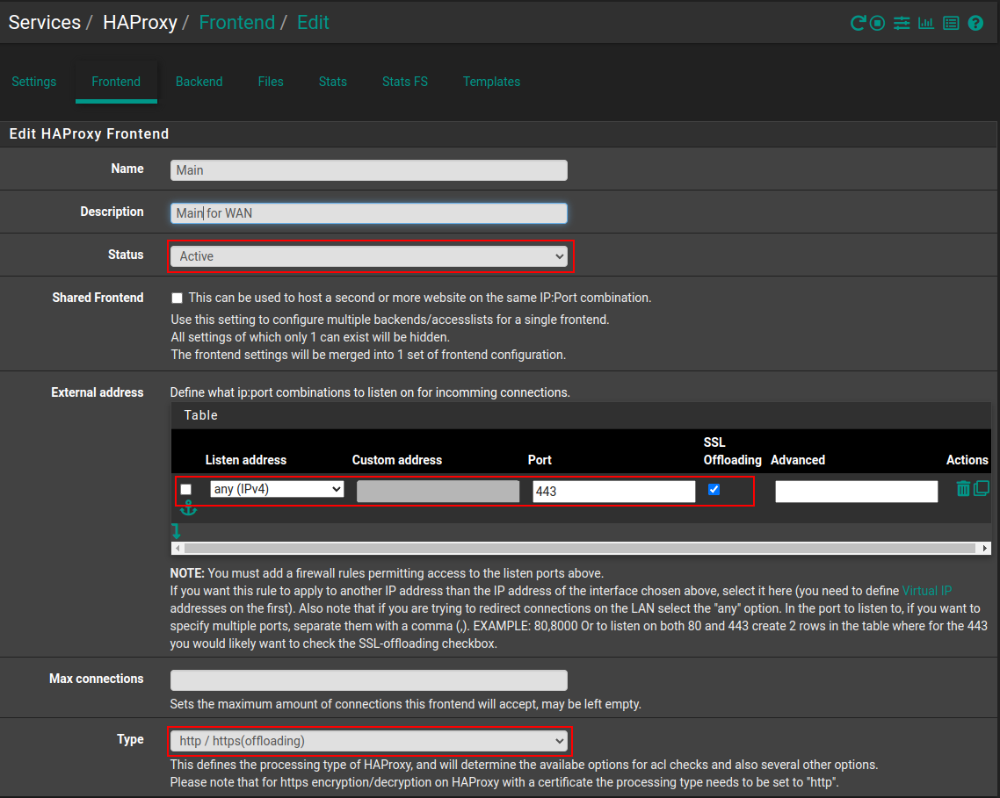

Then, for each service we're hosting, add an entry under *Access Control lists* with *Host matches*, and the FQDN of your service. Let's use once again our fictitious *homelab.com* domain, and we want to host HomeAssistant under the same name. So our URL will be *homeassistant.homelab.com*. Keep both *CS* and *Not* unchecked. Also - and very importantly - be consistent in the *Name* of the entry. It **MUST** exactly match the name we refer it by below.

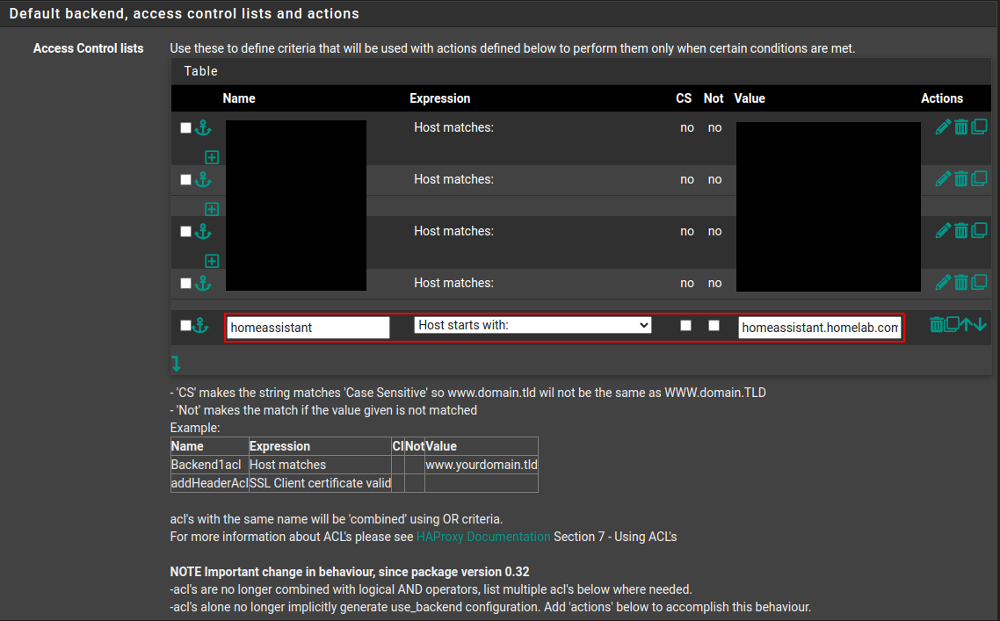

Then, under *Actions*, set the *Condition acl names* to exactly what we named it above:

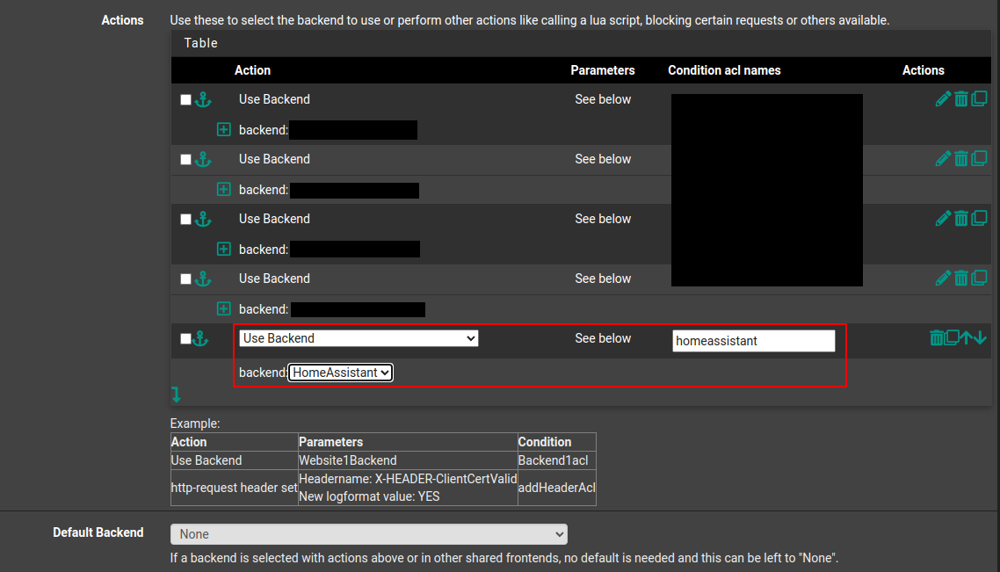

and under *SSL Offloading*, set all the settings like so:

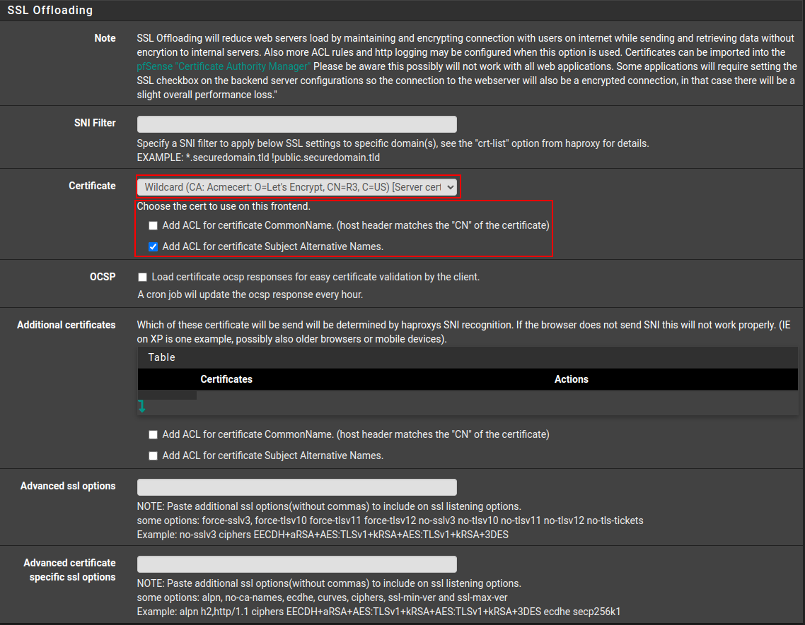

Now, just click on *Save* at the bottom of the page, and we're all set!

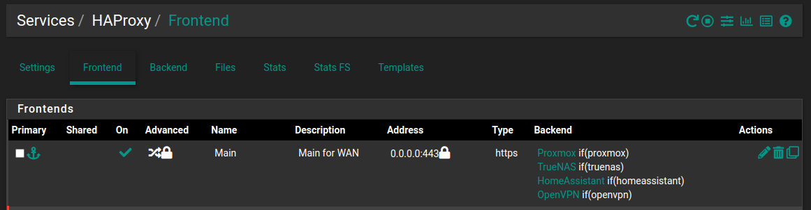

We may have to wait a few minutes for everything to come into effect, but if our [DDNS](#ddns) is running correctly and Cloudflare is set up, we should be able to navigate to *homeassistant.homelab.com* and see our HomeAssistant page, now from anywhere in the world!

## Troubleshooting

### Disable Hardware Checksum

"When using VirtIO interfaces in Proxmox VE, network interface hardware checksum offloading must be disabled. Current versions of pfSense software attempt to disable this automatically for `vtnet` interfaces, but the best practice is to double-check the setting in case changes in Proxmox VE result in the automatic process failing."

 * https://docs.netgate.com/pfsense/en/latest/recipes/virtualize-proxmox-ve.html#disable-hardware-checksums-with-proxmox-ve-virtio

### HAPRoxy interfering with the *webConfigurator*

* Check **WebGUI redirect: Disable *webConfigurator* redirect rule** under *System > Advanced > Admin Access > webConfigurator*.

### DNS Issues

#### DNS Rebind

If, after messing with HAProxy you get this:

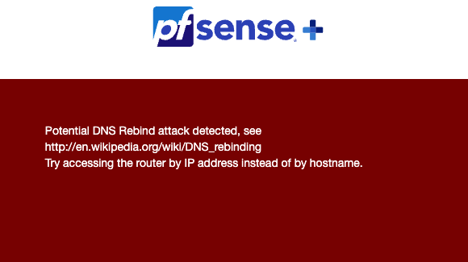

make sure that either **DNS Rebind: CheckDisable DNS Rebinding Checks** is checked or you have **Alternate Hostname** set with your pfSense's FQDN under *System > Advanced > Admin Access > webConfigurator*.

#### No DNS

Make sure that under *System > General Setup > DNS Server Settings*, you have your PiHole's IP address as the first server, but **also** have additional public DNS servers listed below, as such:

#### Cannot access your services from home through HAProxy

First, make sure that your NAT settings under *System > Advanced > Firewall & NAT > Network Address Translation* are as such:

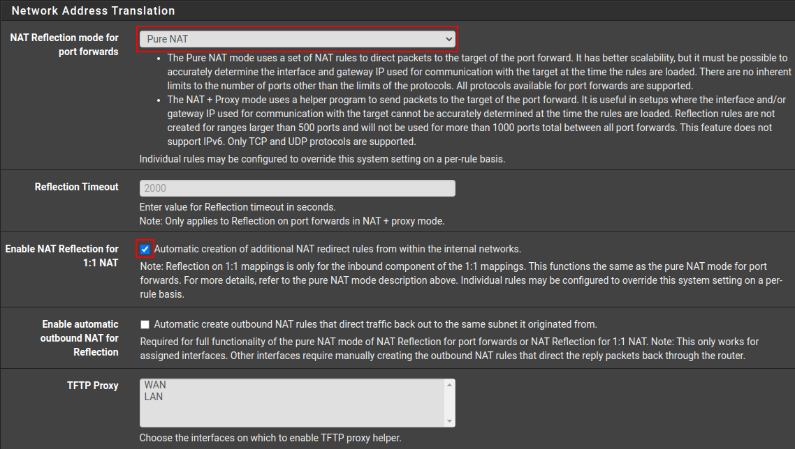

Then, make sure that *Services > DNS Resolver* is **Enabled** and you have entries for each of your services, as such:

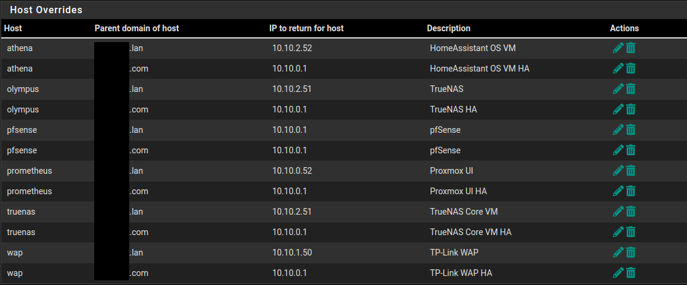

Note that they **MUST** point to your pfSense's IP address, and **NOT** the actual service's IP, since HAProxy lives in pfSense.

### NTP

Just to make sure your pfSense system has the correct time settings - which, if not synced properly, can cause a wide variety of problems - add Google's and NIST's NTP servers under *System > General Setup > Localization*. They are both *stratum 1* servers, very reliable and accurate.

* time.google.com
* time.nist.gov

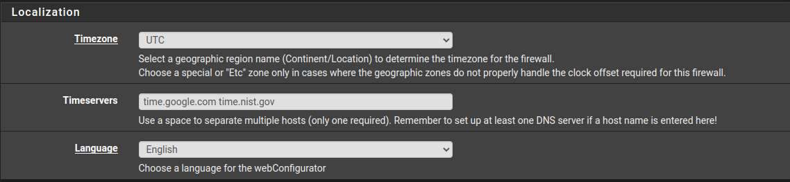

and that your NPT service is up and running, under *Services > NTP > Settings*:

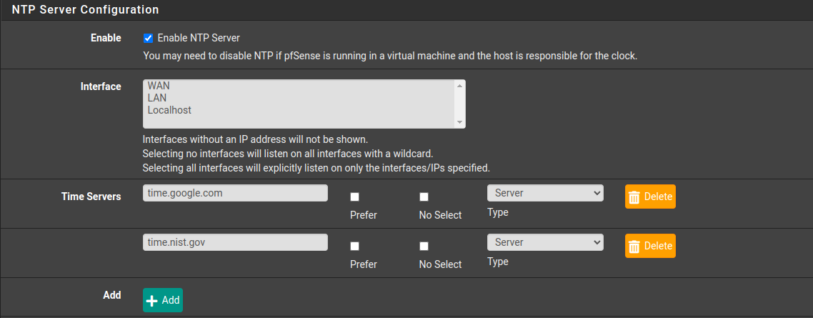

### Private Networks

If you for some reason don't have a Public IP through your ISP, or you're running your pfSense behind another router in a [private network](https://en.wikipedia.org/wiki/Private_network), you must uncheck the **Block private networks and loopback addresses** under *Interfaces > WAN > Reserved Networks*:

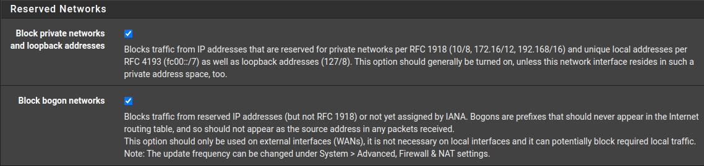
