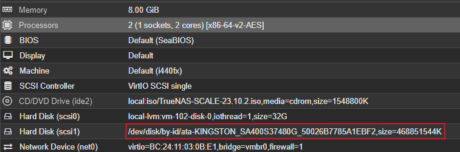
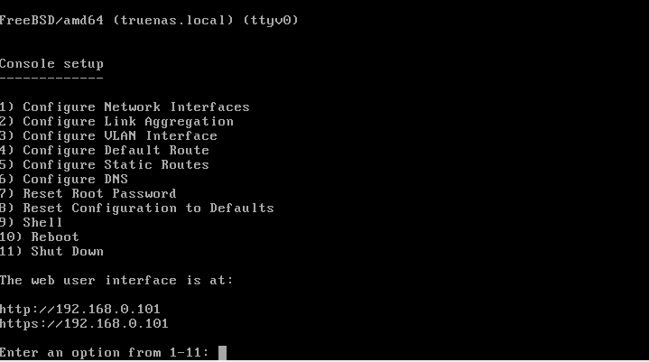
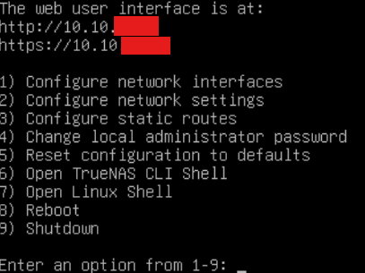
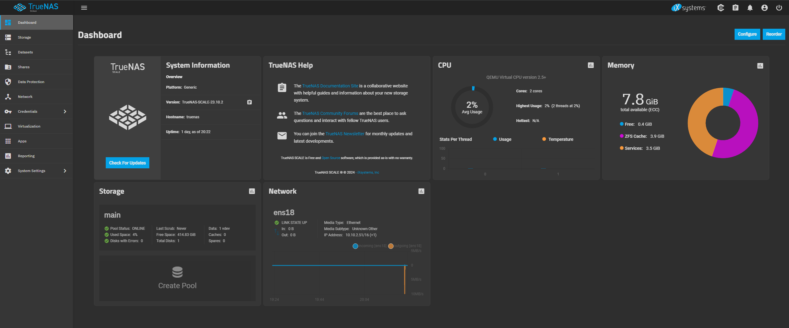
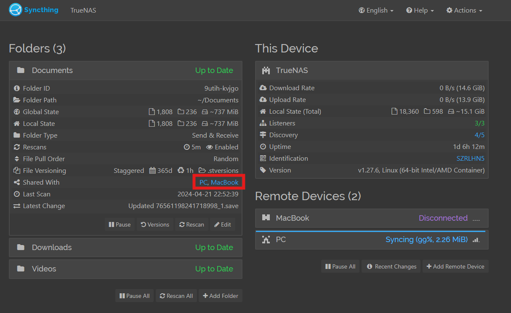
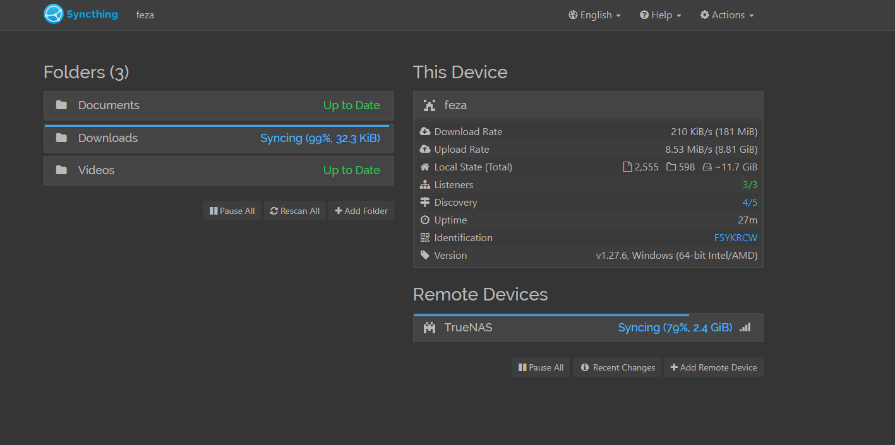

# 

## Installation

We first created another VM in Proxmox and set it to boot using the ISO image downloaded from the following [link](https://www.truenas.com/download-truenas-scale/).

We want to be able to use the SDD we bought for TrueNAS, so we followed [these steps](https://pve.proxmox.com/wiki/Passthrough_Physical_Disk_to_Virtual_Machine_(VM)) to pass through our physical disk to the VM we just created without a PCIe controller. We can confirm that the disk was added by checking the Hardware tab for the VM in Proxmox:

After this, we started the VM and went through the installation steps for TrueNAS. After the installation was successful, we had the following screen:

However, we still haven't set the address for this machine in pfSense, so the IP for the Public Interface listed above is not the final one we'll have. After configuring the static mapping for this machine [here](2_pfsense.md#pihole), we rebooted the machine and the console now shows the final and correct IP address:

## Syncthing

[Syncthing](https://www.truenas.com/docs/scale/scaletutorials/apps/enterpriseapps/syncthing/) is a "file synchronization application that provides a simple and secure environment for file sharing". Instead of using external servers to backup or sync our files, it will allow us to sync files directly with devices within the network we're creating without the "use or need of a central server or cloud storage". We will have Syncthing installed on a desktop computer and a MacBook, which are the two devices with the files/folders we're concerned about syncing. Although one would normally need both devices turned on simultaneously to sync (which almost never happens naturally), we can overcome this challenge using our Mini PC. Since we will also have Syncthing installed in the TrueNAS platform running inside our Mini PC and the PC will always be turned on, it can act as a "bridge" that both devices connect to. When the MacBook is turned on, the relevant files will sync with and be uploaded to the SSD inside the Mini PC. The next time the desktop is turned on, any new files inside the Mini PC will be synced to the desktop. Similarly, any new relevant files on the desktop will be synced to the Mini PC, which will be synced with the MacBook whenever it turns on.

To achieve this, we first opened the TrueNAS public interface at the IP we set for it in pfSense, which is also the one shown after the installation steps above. This is what the dashboard looks like:

We then created a new pool inside the Storage tab and set it to use the SSD we added to the VM for storage. We configured it to have a striped data layout, since we only have one disk, although mirrored (or anything with some redundancy) would be ideal and safer. Next, in the Apps tab, we searched for and installed the Syncthing plugin. We could access its interface through a given port, which we saved using go/ links. Finally, we simply downloaded the [Syncthing application](https://syncthing.net/downloads/) on both the MacBook and the desktop.

Once Syncthing was running on all 3 devices, we connected the MacBook + Mini PC and the desktop + Mini PC. Inside the Syncthing instance running on the MacBook, we can go to Actions > Show ID and copy its device ID, which is used to add it as a remote device on the Mini PC. We did the same thing for the desktop + Mini PC. Once all devices are connected properly, we set the appropriate folders/paths we want to sync between both pairs. We also configured things such as file versioning and how often these folders will be rescanned for any new files. We synced the Documents, Downloads, and Videos folders, and this is what the Syncthing interface running in the TrueNAS platform looked like:

As you can see, it has both the PC and MacBook added as remote devices and is sharing every folder with both. The instance on the desktop PC, on the other hand, is only connected to and sharing folders with the instance running on the Mini PC:

Once we confirmed everything was synced and working properly, we could simply close these tabs and leave each instance running in the background of all devices. The desktop and MacBook would automatically have their files synced with the Mini PC whenever either turns on, and their files would all be eventually synced with each other without the need of having them both on at the same time.
