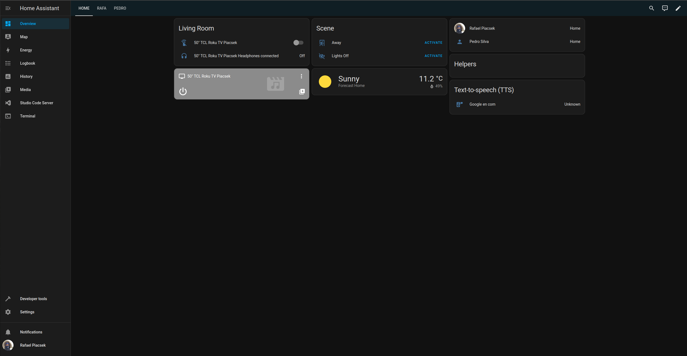

# 

## Instalaltion

Once again, we'll be installing this service on our Proxmox machine. We'll document the Proxmox side of the setup on the Proxmox documentation, which can be found [here](1_proxmox.md#homeassistant).

Now that we have the HomeAssistant VM up and running, it's time to set it up. The first time we turn the VM on we'll be greeted by its welcome page:

From there, we simply follow the setup steps: we create a user, set our location, and after some miscellaneous configurations we end up in our dashboard. Once again, here's a sneak peek of our finished dashboard:

## Configuration

The setup process for HomeAssistant is very straightforward. The first-login wizard takes care of most essential configurations. Then, we just go to **Settings > General** and make sure that our region, language, timezone, dark mode, and all other similar settings about our home and UX are correct.

Another great thing about HomeAssistant is that they have great mobile apps. Aside from just providing access to the dashboard on the go, just like the web interface, it turns the phone itself into a collection of sensors. Once logged in, our phone will appear under devices, and if we go to **Settings > People > \<Your Username\>**, we can associate the phone to our Profile:

To log into our HOmeAssistant server on the mobile app, it will first ask for our server's address. We could simply put the local IP address that we set up for this VM, as [a static lease in pfSense](2_pfsense.md#haproxy), however, this would only be available when connected to your home wifi. To make our setup more useful, we will publicly host our HomeAssistant server through Cloudflare. We know this is not strictly advisable, but since HomeAssistant has 2FA, we feel it's a pretty stable and secure service, and we'll be using fully encrypted traffic between our server and Cloudflare with our own certificates, on top of proxying our actual home IP address with Clousflare's DNS, we thought it was a calculated risk worth taking for the convenience it provides. Another option would be to keep the service internal and add all mobile devices to our VPN, but we chose to do it this way so we don't have to always have the VPN on, and just for the exercise of hosting a service publicly - which allows us to learn about a variety of things.

## Devices

Adding new devices is really simple: all we have to do is go to **Settings > Devices & Services**, and add the integration of the device we want to add! For the WiFi-enabled devices, we first set static IP mappings on pfSense first, so we never have to update any IPs here due to DHCP lease changes. We have a RokuTV and a few Wiz WiFi smartbulbs (which unfortunately broke after a few days, but not due to our setup). We also added the HomeKit Bridge integration, which allows us to control our devices transparently through iPhone's *Home* app, which also has Siri integration. Our devices now look like this:

## Automations

As we mentioned during the [configuration](#configuration) step, being able to associate a phone to a user is very convenient, as we can now set up automations based on the phone's location, and many other stats about the phone. Say, for example, that you are the only one living at home. Then, there's no reason to have any lights on or the temperature set to cold if you're not home. With this, it becomes trivial to set up an automation triggered when you leave home, which shuts off all lights and increases the AC temperature. Similarly, you can do the opposite automation, which sets up your whole home before you get back there from outside. We can do that by going into **Settings > Automations & Scenes > Automations**, and clicking on **Create Automation**. Here's a simple example of what an automation like this looks like:

