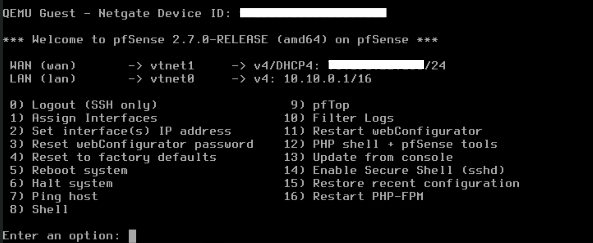

# 

## Dashboard

Here's a sneak peek of our final pfSense dashboard, after applying all the configurations we go over in this document:

## Installation

Installation is made very simple by following Netgate's guide to virtualize pfSense with Proxmox, which can be found [here](https://docs.netgate.com/pfsense/en/latest/recipes/virtualize-proxmox-ve.html). As will not cover the installation steps as we would not do justice to Netgate's resources.

## General Setup

Then, once pfSense is installed, we once again spin up the VM and do some initial configuration through its command line:

First, as discussed in the [Proxmox](proxmox.md) section, we set the `vmbr0/vtnet0` bridge to be the LAN interface and `vmbr1/vtnet1` to be the WAN interface in pfSense. Then, since we want our router to also have a static IP address for obvious reasons, we specify the static IP `10.10.0.1/16` on the LAN interface (`vmbr0/vtnet0`).

Lastly, we reset our *webConfigurator* password, so we don't have the default `admin:pfSense` username and password. This is only temporary, as later we will create another user with admin privileges, and disable the default admin user login.

From there, we just follow the initial [setup wizard](https://docs.netgate.com/pfsense/en/latest/config/setup-wizard.html) to set the basic configurations for pfSense:

We kept our hostname as `pfSense` but changed our domain to the one we bought from Cloudflare for the later stages of the project. For documentation purposes, let's refer to our domain name as *homelab.com*. This then makes our pfSense VM have the FQDN of *pfsense.homelab.com*.

Finally, we'll leave the *Primary DNS Server* empty for now, but once we set up our *PiHole* ad-and-traffic-blocking DNS service, we'll put its static IP address here and a public DNS as backup, which will direct all DNS queries from the entire network to PiHole, as long as we set pfSense's IP as the DNS on all of our DHCP configurations - thus achieving a network-wide ad blocking and advertisement tracking blocking. We recognize that the is an argument about whether blocking ads is a good practice or not, but setting up PiHole does not necessarily mean we will block all ads, as all this depends on what block lists we add to our PiHole instance. One can just as well only add lists of known malicious domains, but allow safe ads to be shown.

## Configurations

After going through the wizard, we have yet a few other modifications we'll need.

First, we need to free up port 443, or the default `HTTPS` port. It is currently being used for the *webConfigurator* portal for pfSense, but we will need it to be free for `HAProxy`, which we'll use to host multiple services through the domain we bought through Cloudflare. And since we're here, let's force the *webConfigurator* to work only through HTTPS (which is much safer, even if we're using our self-signed pfSense certificate) and disable the redirect rule. We'll need to remember we're now using `pfsense.homelab.com:10443` as our *webConfigurator* address from now on (we recommend taking notes of these addresses and ports and *highly* recommend using something like [Trotto go/links](https://www.trot.to/) for ease of use, as this will not be the only service that runs on a custom port which needs to be remembered).

### DHCP

The next step is to set up our DCHP server, which is simple. All we do is go to **Services > DHCP Server > LAN**, and enable it with the following settings:

### Static IP reservations

As mentioned many times, we will assign static IP addresses for all of our core devices and services that we will need to address in the future: our Proxmox server, pfSense, PiHole VM, TrueNAS VM, HomeAssistant VM, our PC (for remote access, so we can access all our resources from our laptop from anywhere), etc. All of these static mappings live here.

### DNS

#### DNS Resolver

[**DNS Resolver**](https://docs.netgate.com/pfsense/en/latest/services/dns/resolver.html) is one of the services available in pfSense, which "utilizes `unbound`, which is a validating, recursive, caching DNS resolver that supports DNSSEC, DNS over TLS, and a wide variety of options. It can act in either a DNS resolver or forwarder role".

We will use the **DNS Resolver** to make some DNS entries, so that we can have local addresses to our devices/VMs, and so we can resolve hosts by their hostname automatically, either from their DCHP lease, static mapping, or later by their hostname in OpenVPN.As an example, say we have a TV with hostname `rokutv`. Then, in HoimeAssistant, for example, we can refer to the TV by its hostname rather than its IP address, without having to manually add a DNS entry for every device - this is done automatically for us.

Strictly speaking, this could be done in PiHole, as it also has a DNS Resolver. However, it is somewhat limited, and we prefer to keep a separation of duties, where PiHole will only handle DNS blocking, and pfSense will handle all the hostname resolution - so we keep all network-related configurations in one place. Thus, if we think about the path a DNS request makes in our network, it will be:

`Device making request > pfSense's DNS Resolver > PiHole > Upstream DNS (Google's or Quad9)`

As we mentioned in the Wizard section, we also added a public DNS service as a secondary DNS server in the General Configuration in case our PiHole fails, so we don't take down the entire network.

#### PiHole

TODO

#### DDNS

TODO

### VPN

TODO

#### OpenVPN

TODO

#### Tailscale

TODO

### Hosting

TODO

#### HAProxy

TODO

#### ACME Certificates

TODO
